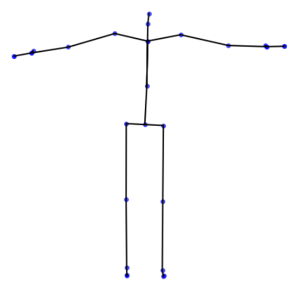
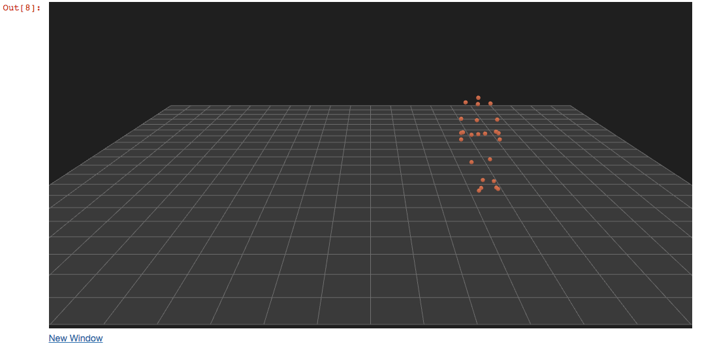
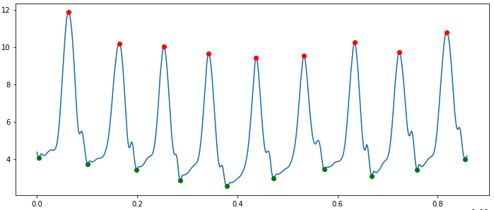
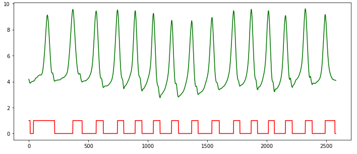

# PyMO
A library for using motion capture data for machine learning

**This library is currently highly experimental and everything is subject to change :)**


## Roadmap
* Mocap Data Parsers and Writers
* Common mocap pre-processing algorithms
* Feature extraction library
* Visualization tools

## Current Features
* [Read BVH Files](#read-bvh-files)
* Write BVH Files
* Pre-processing pipelines
    * [Supporting `scikit-learn` API](#scikit-learn-pipeline-api)
    * Convert data representations 
        * [Euler angles to positions](#convert-to-positions)
        * Euler angles to exponential maps
        * Exponential maps to euler angles
    * Body-oriented global translation and rotation calculation with inverse tranform
    * Root-centric position normalizer with inverse tranform
    * Standard scaler
    * Joint selectors        
* Visualization tools
    * [Skeleton hierarchy](#get-skeleton-info)
    * [2D frame visualization](#visualize-a-single-2d-frame)
    * [3D webgl-based animation](#animate-in-3d-inside-a-jupyter-notebook)
* Annotations
    * Foot/ground contact detector


### Read BVH Files

```python
from pymo.parsers import BVHParser
import pymo.viz_tools

parser = BVHParser()

parsed_data = parser.parse('data/AV_8Walk_Meredith_HVHA_Rep1.bvh')
```

### Get Skeleton Info

```python
import pymo.viz_tools

viz_tools.print_skel(parsed_data)
```
Will print the skeleton hierarchy:
```
- Hips (None)
| | - RightUpLeg (Hips)
| | - RightLeg (RightUpLeg)
| | - RightFoot (RightLeg)
| | - RightToeBase (RightFoot)
| | - RightToeBase_Nub (RightToeBase)
| - LeftUpLeg (Hips)
| - LeftLeg (LeftUpLeg)
| - LeftFoot (LeftLeg)
| - LeftToeBase (LeftFoot)
| - LeftToeBase_Nub (LeftToeBase)
- Spine (Hips)
| | - RightShoulder (Spine)
| | - RightArm (RightShoulder)
| | - RightForeArm (RightArm)
| | - RightHand (RightForeArm)
| | | - RightHand_End (RightHand)
| | | - RightHand_End_Nub (RightHand_End)
| | - RightHandThumb1 (RightHand)
| | - RightHandThumb1_Nub (RightHandThumb1)
| - LeftShoulder (Spine)
| - LeftArm (LeftShoulder)
| - LeftForeArm (LeftArm)
| - LeftHand (LeftForeArm)
| | - LeftHand_End (LeftHand)
| | - LeftHand_End_Nub (LeftHand_End)
| - LeftHandThumb1 (LeftHand)
| - LeftHandThumb1_Nub (LeftHandThumb1)
- Head (Spine)
- Head_Nub (Head)
```


### scikit-learn Pipeline API

```python
data_pipe = Pipeline([
    ('rcpn', RootCentricPositionNormalizer()),
    ('delta', RootTransformer('abdolute_translation_deltas')),
    ('const', ConstantsRemover()),
    ('np', Numpyfier()),
    ('down', DownSampler(2)),
    ('stdscale', ListStandardScaler())
])

piped_data = data_pipe.fit_transform(train_X)
```

### Convert to Positions

```python
mp = MocapParameterizer('positions')

positions = mp.fit_transform([parsed_data])
```

### Visualize a single 2D Frame

```python
draw_stickfigure(positions[0], frame=10)
```



### Animate in 3D (inside a Jupyter Notebook)

```python
nb_play_mocap(positions[0], 'pos', 
              scale=2, camera_z=800, frame_time=1/120, 
              base_url='../pymo/mocapplayer/playBuffer.html')
```




### Foot/Ground Contact Detector
```python
from pymo.features import *

plot_foot_up_down(positions[0], 'RightFoot_Yposition')
```



```python
signal = create_foot_contact_signal(pos_data[3], 'RightFoot_Yposition')
plt.figure(figsize=(12,5))
plt.plot(signal, 'r')
plt.plot(pos_data[3].values['RightFoot_Yposition'].values, 'g')
```



## Feedback, Bugs, and Questions
For any questions, feedback, and bug reports, please use the [Github Issues](https://github.com/omimo/PyMO/issues).

## Original code Credits  [Omid Alemi](https://omid.al/projects/)

## License
This code is available under the [MIT license](http://opensource.org/licenses/MIT).
# WebGL-HumanMocap
